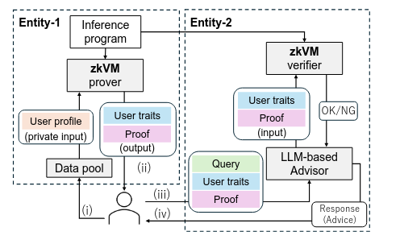
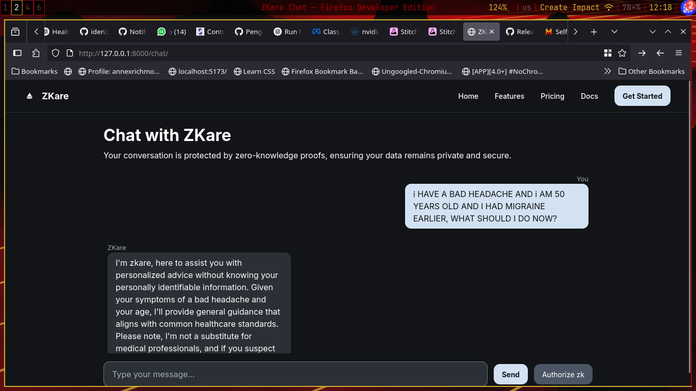

# Agentic Ethereum Hackathon India

# 🛠 ZKare - Team Penguins (NIT Calicut)

Welcome to our submission for the *Agentic Ethereum Hackathon* by Reskilll & Geodework! This repository includes our project code, documentation, and related assets.

---

## 📌 Problem Statement

We addressed the challenge: *“Zero Knowledge Proofs”*  
We often notice that there is a concern of privacy when dealing with LLMs - it is a known fact that LLMs use inputs by users to further train themselves. Here, we present ZKare - a unique solution for financial and healthcare institutions - where LLMs can leveraged, without compromising on privacy, thanks to zero-knowledge proofs.


---

## 💡 Our Solution

*ZKare*

Imagine this scenario: You have a business startup that you are managing and you want to find fresh analytic insights into how the business will grow into the future given the past stats. You do not want to reveal sensitive information pertaining to your customers, for example.

Why is proving necessary? In 2025, AI is agentic, and is often used by large organizations and governments. You still want to use these agents, but not reveal information. Maybe its a 3rd party AI agent that is used by your competitors as well. Maybe you live in an European country, with strict data privacy laws, such as the GDPR.

In comes ZKare. With ZKare, you login to the chatbot website. Your ZK-Prover (such as an accountant that verifies your quarterly revenue) authorizes you to present a proof to the LLM. The LLM (the verifier) authenticates the proof, and you can proceed with its use, as usual

---

## 🧱 Tech Stack

- 🖥 Frontend: HTML/CSS (PoC)
- ⚙ Backend: Rust (Entity 1, prover) + Python (Entity 2, verifier, llm provider)
- 🧠 AI: Llama 3.2
- 🔗 Blockchain: Ethereum
- 🔍 DB/Storage: Postgresql+Redis
- 🚀 Hosting: Self-hosted on institute server

---

## 📽 Demo
- 🎥 *Video Link*: https://drive.google.com/file/d/1VEbS-CGb0LhTKNX-6r5eVXHtUaq5zu7a/view?usp=drivesdk


---

## 📂 Repository Structure

```
.
├── database
│   └── init.sql
├── DEPLOYMENT.md
├── docker-compose.yml
├── entity1-zkproof      # zk-proving service, example
│   ├── build.rs         # the healthcare/business institution
│   ├── Cargo.toml
│   ├── docker
│   ├── Dockerfile
│   ├── migrations
│   └── src
├── entity2-llm          # LLM - llama 3.2
│   ├── app
│   ├── docker
│   ├── Dockerfile
│   └── requirements.txt
├── ENV_SETUP.md
├── README_detailed.md
├── README.md
├── start.sh
└── web-interface        # PoC web interface demo in html css
    ├── Dockerfile
    ├── package.json
    └── src

11 directories, 14 files

```
